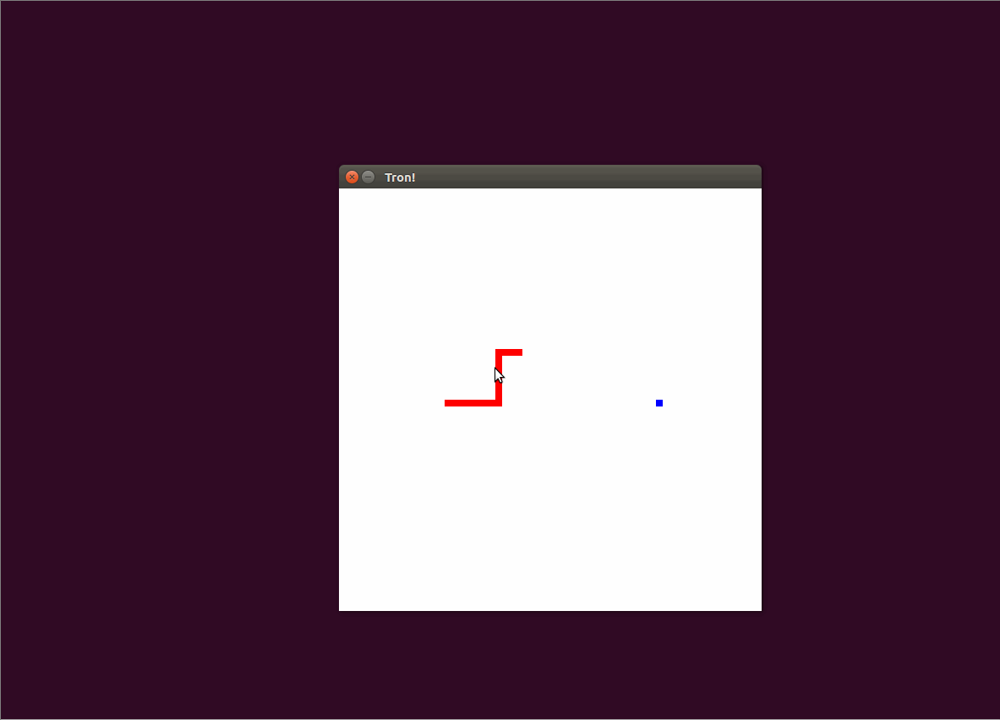

# BasicTron
Basic Tron game made in 10th grade, for FSI at UNC. Player 1 is wasd to move, e for speed. Player 2 is up,left,down,right to move, space for speed. Block your opponent off and win! Run into a trail and lose!

